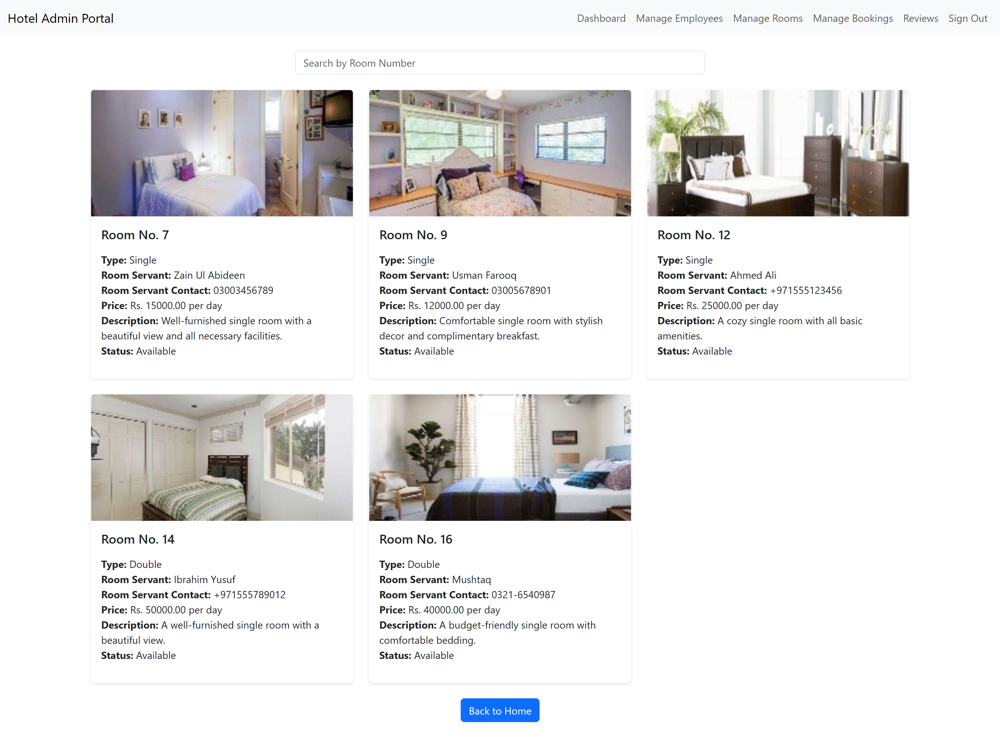

# Hotel-Booking-System 🏨

## Description

A comprehensive platform for hotel management and guest bookings. Features include a user-friendly portal for room reservations, secure payments, and reviews, along with an admin dashboard for managing rooms, bookings, employees, and revenue, ensuring efficient hotel operations.

## Features

### User-Friendly Booking Portal

- View available rooms based on preferences (dates, room types).
- Detailed room descriptions, images, and rates.
- Book a room with details like Name, Email, Contact, Arrival & Departure Dates, Number of Children, and Adults.
- Contact the hotel via a form on the website.
- Seamless integration with Stripe for secure online payments.
- Guests can leave reviews after their stay.

### Admin Portal

- **Dashboard:** Overview of total rooms, occupied rooms, free rooms, total bookings, approved bookings, pending bookings, and generated revenue.
- **Manage Employees:** View, update, and delete employee details like Name, Image, CNIC, Contact, Email, and Salary.
- **Manage Rooms:** Manage room details, including Room No, Type, Servant Name, Contact, Price, Image, Description, and Availability Status. Room history is also available.
- **Manage Bookings:** Approve or reject bookings, with email notifications sent to guests.
- **Reviews:** View guest reviews.

## Screenshots

### Login


### Signup


### Admin Portal

- **Dashboard:**
  
- **View Total Bookings:**
  
- **View Occupied Rooms:**
  
- **View Free Rooms:**
  
- **View Total Bookings:**
  
- **Approved Bookings:**
  
- **Pending Bookings:**
  
- **Rejected Bookings:**
  
- **Revenue:**
  
- **Manage Employees:**
  
- **Add Employee:**
  
- **Edit Employee:**
  
- **Manage Rooms:**
  
- **View Room History:**
  
- **Manage Booking:**
  
- **Reviews:**
  

### Guest Portal

- **View Rooms:**
  
- **View Room Detailed:**
  
- **Room Stripe Payment:**
  
- **View My Bookings:**
  

## Getting Started

### Prerequisites

- [Node.js](https://nodejs.org/)
- [npm](https://www.npmjs.com/)
- [SQL Database]()

### Installation

1. Clone the repository:

   ```bash
   git clone https://github.com/Abdur-Rehman-643/Hotel-Booking-System.git
   ```

2. Navigate to the project directory:
   ```bash
   cd Hotel-Booking-System
   ```

### Backend Setup (Express)

1. Navigate to the backend directory:

   ```bash
   cd backend
   ```

2. Install backend dependencies:

   ```bash
   npm install
   ```

3. Configure the database connection in `config/database.js`.

4. Start the backend server:
   ```bash
   npm start
   ```

### Frontend Setup (Vite React)

1. Navigate to the frontend directory:

   ```bash
   cd frontend
   ```

2. Install frontend dependencies:

   ```bash
   npm install
   ```

3. Start the frontend server:

   ```bash
   npm run start
   ```

4. Open your browser and navigate to `http://localhost:5173`.
